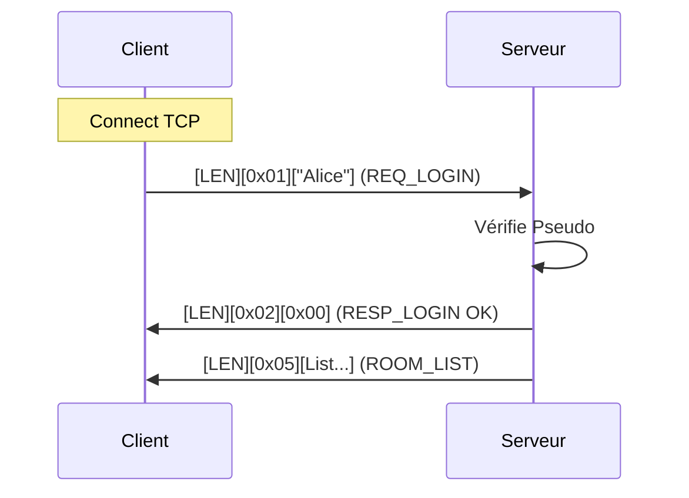
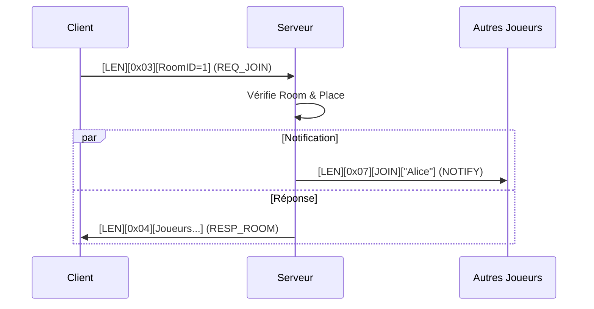
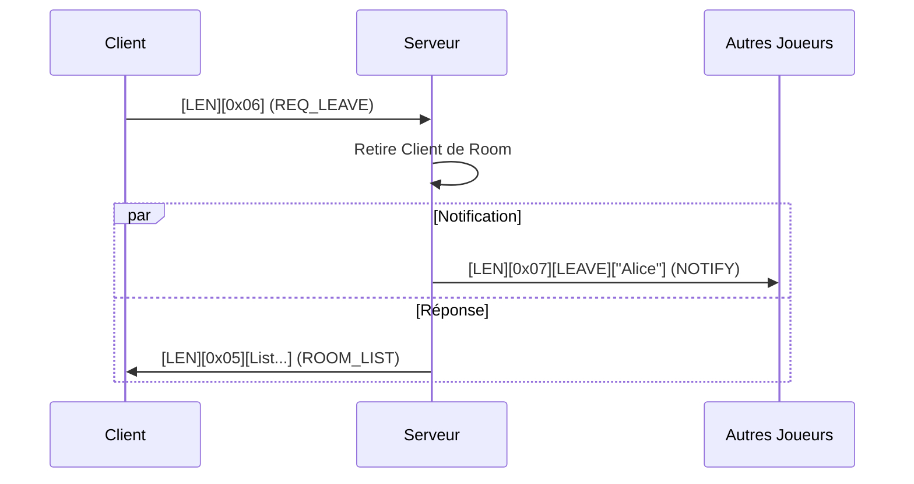

# PROTOCOL.md

Ce document décrit de manière exhaustive le protocole de communication utilisé par l'application PyGhost.

## Vue d'ensemble

- **Transport** : TCP
- **Architecture** : Client / Serveur
- **Encodage** : Binaire (Big-Endian pour les nombres)
- **Chaînes de caractères** : Encodées en UTF-8

### Frontières

1.  **Couche Protocole** : Gère la connexion, l'authentification (Login), la gestion des sessions (Rooms), et le transport de données opaques.
2.  **Couche Application** : Gère la logique spécifique du jeu (encapsulée dans les messages `DATA`).

---

## Format des Messages

Chaque message échangé respecte la structure suivante :

```
[ En-tête (4 octets) ] [ Corps (Variable) ]
```

### En-tête

| Champ  | Taille   | Type             | Description                                     |
| ------ | -------- | ---------------- | ----------------------------------------------- |
| Taille | 4 octets | UInt32 (Big-End) | Taille du **Corps** (Payload) en octets. |

### Corps (Payload)

Structure générique du Payload :

```
[ OpCode (1 octet) ] [ Données (Taille - 1 octets) ]
```

- **OpCode** : Identifiant du type de message.
- **Données** : Contenu spécifique au message.

---

## Liste des OpCodes

| OpCode | Hex  | Nom          | Direction | Description |
| ------ | ---- | ------------ | --------- | ----------- |
| 1      | 0x01 | REQ_LOGIN    | C -> S    | Demande de connexion avec un pseudo. |
| 2      | 0x02 | RESP_LOGIN   | S -> C    | Réponse à la demande de connexion. |
| 3      | 0x03 | REQ_JOIN     | C -> S    | Demande pour rejoindre une room. |
| 4      | 0x04 | RESP_ROOM    | S -> C    | Informations sur la room rejointe (liste joueurs). |
| 5      | 0x05 | ROOM_LIST    | S -> C    | Liste des rooms disponibles. |
| 6      | 0x06 | REQ_LEAVE    | C -> S    | Demande pour quitter la room courante. |
| 7      | 0x07 | NOTIFY       | S -> C    | Notification d'événement (Join/Leave). |
| 8      | 0x08 | DATA         | Bilatéral | Transport de données applicatives (Jeu). |
| 253    | 0xFD | PING         | S -> C    | Vérification de présence (Heartbeat). |
| 254    | 0xFE | PONG         | C -> S    | Réponse au Heartbeat. |
| 255    | 0xFF | ERROR        | S -> C    | Signalement d'une erreur. |

---

## Détail des Messages

### 1. Connexion (Login)

**C -> S : REQ_LOGIN (0x01)**
- Format de la requête : `[Size (4 bytes BE)] [OpCode (1 byte)][Pseudo (UTF-8 bytes)]`
- Exemple : `00 00 00 06 01 41 6C 69 63 65` ("Alice")

**S -> C : RESP_LOGIN (0x02)**
- Format de la réponse : `[Size (4 bytes BE)] [OpCode (1 byte)][Status (1 octet)]`
- Status :
  - `0x00` : OK
  - `0x01` : REFUSED (Pseudo invalide ou pris)
- Exemple : `00 00 00 02 02 00` (OK)

### 2. Gestion des Rooms

**S -> C : ROOM_LIST (0x05)**
- Format de la réponse : `[Size (4 bytes BE)] [OpCode (1 byte)][NbRooms (1o)] + N * [ID(4o) + LenName(1o) + Name + Players(1o) + Max(1o)]`
- Description : Liste toutes les rooms disponibles.

**C -> S : REQ_JOIN (0x03)**
- Format de la requête : `[Size (4 bytes BE)] [OpCode (1 byte)][RoomID (4 octets Big-Endian)]`

**S -> C : RESP_ROOM (0x04)**
- Format de la réponse : `[Size (4 bytes BE)] [OpCode (1 byte)][NbPlayers (1o)] + N * [LenPseudo(1o) + Pseudo]`
- Description : Liste des joueurs présents dans la room rejointe.

**C -> S : REQ_LEAVE (0x06)**
- Format de la requête : `[Size (4 bytes BE)] [OpCode (1 byte)]`
- Payload vide.
- Description : Demande pour quitter la room courante. Le serveur envoie ensuite un `ROOM_LIST` mis à jour.

**S -> C : NOTIFY (0x07)**
- Format de la réponse : `[Size (4 bytes BE)] [OpCode (1 byte)][Type (1o)] + [LenPseudo(1o) + Pseudo]`
- Type :
  - `0x00` : JOIN (Un joueur a rejoint)
  - `0x01` : LEAVE (Un joueur a quitté)

### 3. Transport Applicatif

**C <-> S : DATA (0x08)**
- Format de la requête : `[Size (4 bytes BE)] [OpCode (1 byte)][AppBytes (Variable)]`
- Description : Contient les données du jeu. Le protocole ne les interprète pas.

### 4. Maintenance

**S -> C : PING (0xFD)**
- Format de la requête : `[Size (4 bytes BE)] [OpCode (1 byte)]`
- Payload vide.

**C -> S : PONG (0xFE)**
- Format de la requête : `[Size (4 bytes BE)] [OpCode (1 byte)]`
- Payload vide.

**S -> C : ERROR (0xFF)**
- Format de la réponse : `[Size (4 bytes BE)] [OpCode (1 byte)][ErrCode (1o)] + [Message (UTF-8)]`

---

## Séquences

### Connexion Réussie



### Rejoindre une Room



### Quitter une Room

